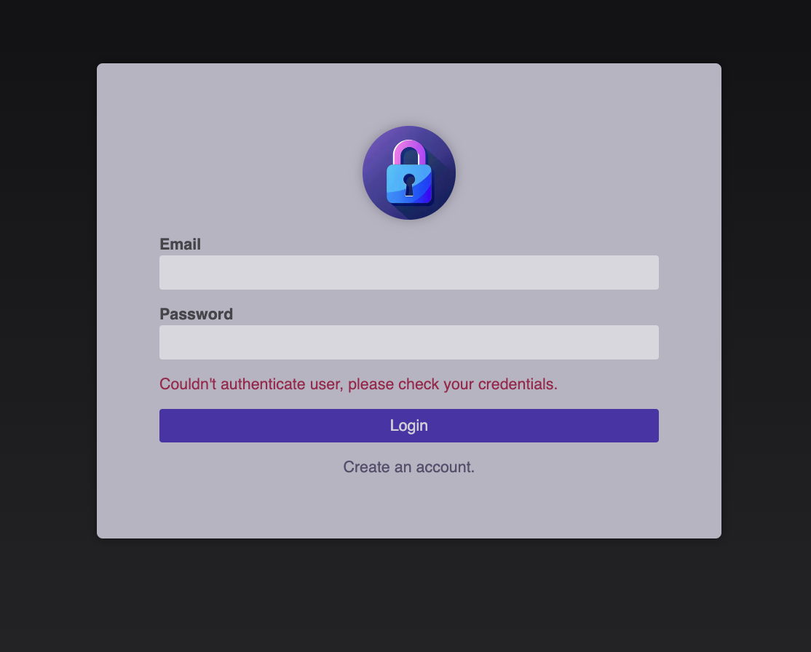

# Next TRaining


A comprehensive demonstration of Next.js 15's authentication using [Next Auth](https://next-auth.js.org/) based on [Maximilian Schwarzmüller's Udemy course](https://www.udemy.com/course/react-the-complete-guide-incl-redux).

## Setup

1. Install dependencies:

   ```bash
   pnpm install
   ```

2. Initialize the SQLite database:
   ```bash
   pnpm db:init
   ```

3. Authentication is using Next Auth. Set up the following environment variables:

   ```bash
   ...
   ```

## Next Training Demo

## Screenshots

TRaining Auth



Training List (protected)

